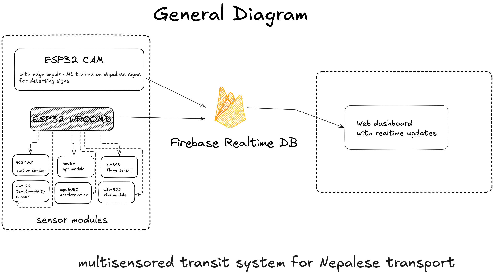

# Multisensory Transit System for Nepal

A complete IoT-based public transportation monitoring system developed for Nepal's bus network. This final year project combines hardware sensors with a web dashboard to monitor vehicle conditions, manage RFID payments, and track buses in real-time across Nepal's urban transport system.

## System Architecture




## Core Features

### Passenger Monitoring with HCSR501 PIR Sensor
- **Accurate People Counting**: Tracks passengers boarding and alighting buses
- **Real-time Occupancy**: Live passenger count displayed on dashboard
- **Capacity Management**: Alerts when bus approaches maximum capacity

### RFID Payment System (RFC522)
- **Tap In/Tap Out**: Passengers tap RFID cards when boarding and leaving
- **Balance Management**: Top-up cards remotely through the web app
- **Unauthorized Detection**: System flags invalid or blocked cards
- **Timestamp Accuracy**: Precise logging of all transactions with Nepal time

### Fire Safety with LM393 Flame Sensor
- **Early Fire Detection**: Immediate alerts for flame detection inside buses
- **Safety Dashboard**: Visual fire status indicators with alarm systems

### Vehicle Stability Monitoring (MPU6050)
- **Abnormal Position Detection**: Monitors dangerous vehicle tilts and positions
- **Safety Alerts**: Real-time alerts logged with timestamps in reports dashboard
-  **Alert History**: Complete log of all safety incidents

### GPS Tracking with NEO-6M Module
- **Live Bus Tracking**: Real-time location updates on interactive maps with coordinates
- **Location Display**: Shows precise latitude and longitude positioning

### Traffic Sign Recognition (ESP32-CAM + Edge Impulse)
- **Nepal-Specific Training**: Model trained on Nepal's traffic signs including:
  - Stop signs
  - No parking zones
  - No U-turn areas  
  - Bus stop indicators
  - Pedestrian crossings
- **Real-time Processing**: Live traffic sign detection
- **Driver Assistance**: Visual alerts for detected traffic signs in the dashboard

### Environmental Monitoring (DHT22)
 - **Temperature Tracking**: Real-time temperature monitoring with status indicators
 - **Humidity Monitoring**: Live humidity readings with normal/abnormal readings
 - **Alert Integration**: Environmental data feeds into overall safety monitoring

<details>
<summary>Hardware Components</summary>

- **ESP32 WROOM-32D**: Main microcontroller for sensor integration and WiFi connectivity
- **HCSR501 PIR Sensor**: Motion detection for passenger counting
- **LM393 Flame Sensor**: Fire detection and safety monitoring  
- **MPU6050 Accelerometer**: 6-axis motion tracking for vehicle stability
- **NEO-6M GPS Module**: Satellite positioning for location tracking
- **DHT22 Sensor**: Temperature and humidity monitoring
- **RFC522 RFID Reader**: Contactless payment card processing
- **ESP32-CAM Module**: Computer vision for traffic sign recognition

</details>

<details>
<summary>Software Stack</summary>

- **Frontend**: Next.js 15, React 19, TypeScript
- **Styling**: Tailwind CSS 4.0, Radix UI components  
- **Database**: Firebase Realtime Database
- **Maps**: Leaflet with React-Leaflet for Nepal mapping
- **Charts**: Recharts for sensor data visualization
- **ML Model**: Edge Impulse for traffic sign recognition
- **Hardware Communication**: WiFi-based real-time data transmission

</details>

## Getting Started

1. **Clone the repository**
```bash
git clone https://github.com/yourusername/multisensory-transit-system.git
cd multisensory-transit-system
```

2. **Install dependencies**
```bash
npm install
npm install firebase
```

3. **Set up Firebase**
   - Create a Firebase project
   - Enable Realtime Database
   - Add your Firebase config to the services

4. **Run the development server**
```bash
npm run dev
```

5. **Open the application**
   Navigate to [http://localhost:3000](http://localhost:3000)

## Demo

Visit: [https://multisensory-transit-system.vercel.app/dashboard](https://multisensory-transit-system.vercel.app/dashboard)

---

*This project was developed as a final year capstone project, demonstrating the integration of IoT sensors, real-time databases, and modern web technologies for smart city applications.*
